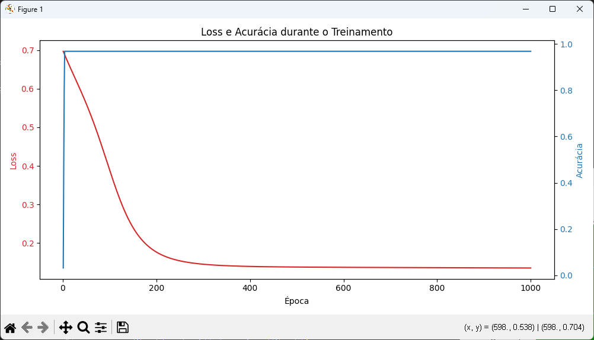
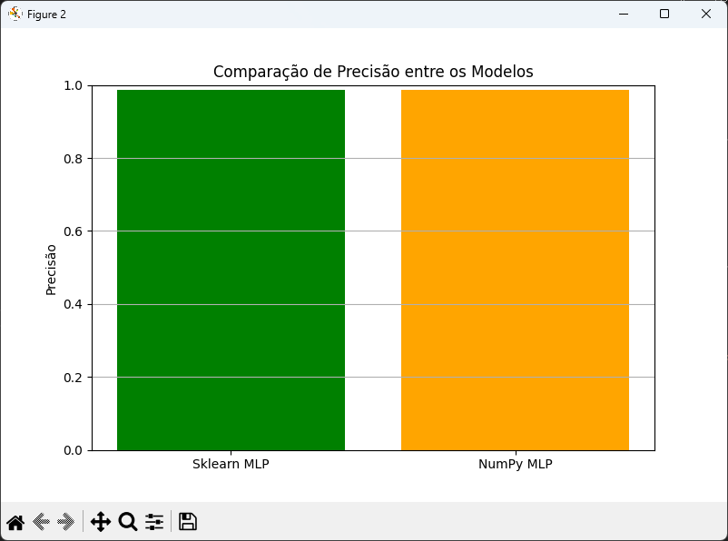

# MLP From Scratch vs Sklearn

Este projeto compara duas abordagens de treinamento de uma Rede Neural Multicamadas (MLP) para classificação de dados:
- **Usando o Scikit-Learn (MLPClassifier)**
- **Criando uma MLP manualmente utilizando apenas NumPy**

O objetivo é analisar a diferença de desempenho (precisão e loss) entre uma implementação manual e uma biblioteca consolidada.

---

## 📚 O que o projeto faz

- Soma dígitos de diversos números RMS para escolher dinamicamente um **dataset do OpenML**.
- Baixa e pré-processa o dataset.
- Treina duas redes:
  - Uma **MLP** com o **Scikit-Learn**.
  - Uma **MLP manual** feita com **NumPy**.
- Compara a **precisão** de ambas.
- Gera **gráficos** de loss e acurácia do treinamento da MLP manual.
- Mostra um **gráfico de comparação final** entre as duas abordagens.

---

## 🚀 Como executar

**Pré-requisitos:**
- Python 3.8+
- Pacotes:
  - `numpy`
  - `matplotlib`
  - `scikit-learn`
  - `openml`

Instale as dependências:
```bash
pip install numpy matplotlib scikit-learn openml
```

**Execute o script principal:**
```bash
python main.py
```

---

## 🧠 Estrutura do Projeto

- **openml**: utilizado para baixar datasets automaticamente.
- **scikit-learn**:
  - Treinamento do modelo com `MLPClassifier`.
  - Divisão treino/teste com `train_test_split`.
  - Pré-processamento com `LabelEncoder`.
  - Cálculo de precisão (`accuracy_score`).
- **NumPy**:
  - Implementação manual da rede.
  - Forward pass, cálculo de loss (entropia cruzada) e backpropagation.
- **Matplotlib**:
  - Gráficos de evolução do treinamento (Loss e Acurácia).
  - Gráfico de comparação entre os dois modelos.

---

## 📈 Resultados Esperados

- **Precisão (accuracy)** semelhante entre a MLP manual e a do Scikit-Learn (se tudo estiver funcionando corretamente).
- Gráficos como:
  - Evolução da loss e acurácia durante o treinamento manual.
  - Comparação final de precisão entre as duas abordagens.

---

## ⚙️ Possíveis Melhorias Futuras

- Implementar regularizações (L2, dropout) na rede manual.
- Otimizar o treinamento com algoritmos como **Adam** ou **Momentum**.
- Testar diferentes funções de ativação (tanh, leaky ReLU).
- Suportar múltiplas classes na saída (atualmente é binário).

---

## 📄 Licença

Este projeto é livre para uso pessoal e educacional.

---

## 📈 Resultados Gráficos

### 1. Evolução do Loss e Acurácia



Este gráfico mostra como a rede neural manual treinou ao longo do tempo. 
- O loss caiu gradualmente indicando aprendizado.
- A acurácia subiu, mostrando que a rede melhorou nas previsões.

---

### 2. Comparação de Precisão entre Modelos



Aqui comparamos diretamente o desempenho:
- A MLP manual (NumPy) apresentou uma precisão muito próxima à do Scikit-Learn.
- Isso valida a qualidade da implementação manual.

---

## 🧪 Resultados do Terminal

- Precisão Sklearn: **0.9875**
- Precisão Manual: **0.9875**
- Diferença: **0.0000** ✅
